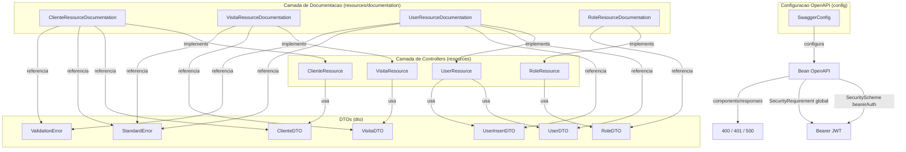

# Design Document

## swagger-enrichment

## Visao Geral

A feature **swagger-enrichment** transforma a documentacao Swagger da API CarteiraClientes de um conjunto minimo de metadados globais em um guia de uso completo e autossuficiente para corretores de imoveis e desenvolvedores que consomem a API.

O design adota duas camadas complementares:

1. **Interfaces Contratuais** - quatro interfaces Java no pacote `resources/documentation/` que concentram todas as anotacoes OpenAPI. Os controllers implementam essas interfaces e ficam livres de qualquer anotacao Swagger.
2. **SwaggerConfig Enriquecido** - o bean `OpenAPI` passa a incluir esquema de seguranca Bearer JWT, `SecurityRequirement` global e respostas de erro padrao (400, 401, 500) registradas nos `components`, eliminando repeticao nas interfaces.

Essa separacao garante que a logica de roteamento dos controllers nao seja poluida por metadados de documentacao, e que qualquer alteracao na documentacao de um endpoint seja feita exclusivamente na interface correspondente.

---

## Arquitetura

### Diagrama de Componentes



### Fluxo de Resolucao de Anotacoes

Quando o springdoc-openapi escaneia os controllers na inicializacao do contexto Spring, ele percorre a hierarquia de interfaces implementadas por cada `@RestController`. As anotacoes OpenAPI declaradas nas interfaces contratuais sao herdadas pelos controllers via mecanismo padrao de reflexao Java, sem necessidade de nenhuma configuracao adicional no springdoc.

O bean `OpenAPI` produzido pelo `SwaggerConfig` e mesclado com o spec gerado pelas interfaces, resultando em um documento OpenAPI 3.x completo com:

- Metadados globais (titulo, versao, descricao)
- Esquema de seguranca Bearer JWT
- Requisito de seguranca aplicado a todos os endpoints
- Respostas de erro globais (400, 401, 500) nos `components`
- Documentacao detalhada de cada endpoint via interfaces contratuais

### Decisoes de Design

#### 1. Interfaces em vez de classes abstratas

**Decisao:** Usar interfaces Java puras (sem implementacao) para as interfaces contratuais.

**Justificativa:** Interfaces permitem que os controllers mantenham sua propria hierarquia de heranca sem restricoes. O springdoc-openapi resolve anotacoes OpenAPI em interfaces implementadas por `@RestController` de forma nativa, sem configuracao adicional. Classes abstratas introduziriam acoplamento desnecessario e impediriam heranca multipla.

#### 2. Pacote `resources/documentation/` dedicado

**Decisao:** Criar subpacote `resources/documentation/` para as interfaces contratuais.

**Justificativa:** Manter as interfaces no mesmo pacote raiz dos controllers (`resources/`) facilita a navegacao e deixa claro que sao contratos de documentacao para os resources. O subpacote `documentation/` sinaliza explicitamente a responsabilidade dessas interfaces, separando-as de qualquer logica de negocio.

#### 3. Respostas de erro globais no SwaggerConfig

**Decisao:** Registrar as respostas 400, 401 e 500 como componentes globais no `OpenAPI` bean via `components().addResponses(...)`.

**Justificativa:** Evita repeticao das mesmas anotacoes `@ApiResponse` em todos os endpoints. Endpoints que precisam de comportamento especifico para esses codigos podem sobrescrever localmente com `@ApiResponse` explicito na interface contratual, e o springdoc exibira a definicao local sem duplicar a global.

#### 4. Anotacoes `@Tag` nas interfaces, nao nos controllers

**Decisao:** As anotacoes `@Tag` sao declaradas nas interfaces contratuais, nao nos controllers.

**Justificativa:** Consistente com o principio de separacao de responsabilidades. O controller nao deve conhecer nada sobre documentacao.

#### 5. Exemplos de negocio coerentes com o dominio imobiliario

**Decisao:** Todos os exemplos de payload usam dados reais do dominio (nomes de corretores, valores de imoveis, datas de visita plausíveis).

**Justificativa:** A Swagger UI deve funcionar como guia de uso autossuficiente. Exemplos genericos como `string` ou `0` nao comunicam o contexto de negocio e dificultam o entendimento da API por novos consumidores.

---

## Componentes e Interfaces

### Estrutura de Pacotes

```
src/main/java/.../carteiraclientes/
├── config/
│   └── SwaggerConfig.java                    # Bean OpenAPI enriquecido (MODIFICADO)
└── resources/
    ├── ClienteResource.java                  # Implementa ClienteResourceDocumentation (MODIFICADO)
    ├── VisitaResource.java                   # Implementa VisitaResourceDocumentation (MODIFICADO)
    ├── UserResource.java                     # Implementa UserResourceDocumentation (MODIFICADO)
    ├── RoleResource.java                     # Implementa RoleResourceDocumentation (MODIFICADO)
    └── documentation/                        # NOVO pacote
        ├── ClienteResourceDocumentation.java # NOVO
        ├── VisitaResourceDocumentation.java  # NOVO
        ├── UserResourceDocumentation.java    # NOVO
        └── RoleResourceDocumentation.java    # NOVO

src/test/java/.../carteiraclientes/
└── resources/
    └── SwaggerDocumentationArchTest.java     # NOVO - testes ArchUnit
```

### 3.1 ClienteResourceDocumentation

Interface contratual para `ClienteResource`. Declara os 6 endpoints de `/clientes` com anotacoes OpenAPI completas.

**Pacote:** `com.github.marcelomachadoxd.carteiraclientes.resources.documentation`

**Anotacao de classe:** `@Tag(name = "Clientes", description = "Gerenciamento da carteira de clientes dos corretores de imoveis")`

**Metodos declarados e suas anotacoes:**

| Metodo | HTTP | Path | @Operation summary | @ApiResponse codes |
|---|---|---|---|---|
| `findById` | GET | `/clientes/id/{id}` | Busca cliente por ID | 200, 404 |
| `findByNome` | GET | `/clientes/nome/{nome}` | Busca clientes por nome | 200 |
| `findByInteresses` | GET | `/clientes` | Filtra clientes por perfil de interesse | 200 |
| `insert` | POST | `/clientes` | Cadastra novo cliente | 201, 422 |
| `update` | PUT | `/clientes/id/{id}` | Atualiza dados do cliente | 200, 404, 422 |
| `delete` | DELETE | `/clientes/id/{id}` | Remove cliente | 204, 404 |

O endpoint `GET /clientes` recebe `@Parameter` para cada um dos 6 query params (`margem`, `qtdQuartos`, `qtdBanheiros`, `qtdVagas`, `metragem`, `valorMaximo`). A descricao de `margem` explica que e um percentual aplicado sobre `valorMaximo` e `metragem`, e que o valor `0` desativa o filtro para aquele parametro.

O endpoint `POST /clientes` recebe `@RequestBody` com exemplo de payload contendo todos os campos editaveis do `ClienteDTO` com valores coerentes ao dominio imobiliario.

### 3.2 VisitaResourceDocumentation

Interface contratual para `VisitaResource`. Declara os 6 endpoints de `/visitas` com anotacoes OpenAPI completas.

**Pacote:** `com.github.marcelomachadoxd.carteiraclientes.resources.documentation`

**Anotacao de classe:** `@Tag(name = "Visitas", description = "Registro e consulta de visitas a imoveis realizadas pelos corretores")`

**Metodos declarados e suas anotacoes:**

| Metodo | HTTP | Path | @Operation summary | @ApiResponse codes |
|---|---|---|---|---|
| `findById` | GET | `/visitas/{id}` | Busca visita por ID | 200, 404 |
| `findByResponsavelId` | GET | `/visitas/responsavel/{id}` | Lista visitas por corretor | 200 |
| `findByClienteId` | GET | `/visitas/cliente/{id}` | Lista visitas por cliente | 200 |
| `findByClienteAndResponsavelId` | GET | `/visitas` | Filtra visitas por cliente e corretor | 200 |
| `insert` | POST | `/visitas` | Registra nova visita | 200, 422 |
| `delete` | DELETE | `/visitas/{id}` | Remove visita | 204, 404 |

O endpoint `GET /visitas` recebe `@Parameter` para `cliId` e `respId` com `required = false` e `example = 1`, descrevendo que os filtros sao aplicados simultaneamente (AND logico).

O endpoint `POST /visitas` recebe `@RequestBody` com exemplo de payload contendo `dataVisita`, `obs`, `satisfacao`, `responsavel.id` e `cliente.id`.

### 3.3 UserResourceDocumentation

Interface contratual para `UserResource`. Declara os 4 endpoints de `/users` com anotacoes OpenAPI completas.

**Pacote:** `com.github.marcelomachadoxd.carteiraclientes.resources.documentation`

**Anotacao de classe:** `@Tag(name = "Usuarios", description = "Gerenciamento dos corretores cadastrados no sistema")`

**Metodos declarados e suas anotacoes:**

| Metodo | HTTP | Path | @Operation summary | @ApiResponse codes |
|---|---|---|---|---|
| `findAllPageable` | GET | `/users` | Lista todos os corretores | 200 |
| `findById` | GET | `/users/{id}` | Busca corretor por ID | 200, 404 |
| `insert` | POST | `/users` | Cadastra novo corretor | 200, 422 |
| `delete` | DELETE | `/users/{id}` | Remove corretor | 204, 404 |

O endpoint `POST /users` recebe `@RequestBody` com exemplo de payload de `UserInsertDTO` contendo `nome = "Joao Corretor"`, `email = "joao.corretor@imobiliaria.com.br"`, `acessoId = 1` e `password = "senha123"`.

Os campos de `UserDTO` recebem `@Schema(example = ...)` com `id = 2`, `nome = "Joao Corretor"`, `email = "joao.corretor@imobiliaria.com.br"`.

### 3.4 RoleResourceDocumentation

Interface contratual para `RoleResource`. Declara os 2 endpoints de `/roles` com anotacoes OpenAPI completas.

**Pacote:** `com.github.marcelomachadoxd.carteiraclientes.resources.documentation`

**Anotacao de classe:** `@Tag(name = "Roles", description = "Gerenciamento dos perfis de acesso dos corretores")`

**Metodos declarados e suas anotacoes:**

| Metodo | HTTP | Path | @Operation summary | @ApiResponse codes |
|---|---|---|---|---|
| `findAll` | GET | `/roles` | Lista todos os perfis de acesso | 200 |
| `insert` | POST | `/roles` | Cadastra novo perfil de acesso | 201 |

O endpoint `POST /roles` recebe `@RequestBody` com exemplo de payload de `RoleDTO` contendo apenas `nome = "ROLE_CORRETOR"` (sem `id`, que e gerado pelo servidor).

Os campos de `RoleDTO` recebem `@Schema(example = ...)` com `id = 1` e `nome = "ROLE_CORRETOR"`.

---

## Modelos de Dados

Esta feature nao introduz novos modelos de dados. Os DTOs existentes sao enriquecidos com anotacoes `@Schema` para melhorar a documentacao gerada pelo springdoc-openapi.

### Anotacoes @Schema nos DTOs

As anotacoes `@Schema(example = ...)` sao adicionadas diretamente nos campos dos DTOs para que o springdoc-openapi gere exemplos coerentes na Swagger UI.

#### ClienteDTO

| Campo | Tipo | @Schema example |
|---|---|---|
| `id` | Long | `1` |
| `nome` | String | `"Maria Silva"` |
| `email` | String | `"maria.silva@email.com"` |
| `qtdQuartos` | Integer | `2` |
| `qtdBanheiros` | Integer | `1` |
| `qtdVagas` | Integer | `1` |
| `metragem` | Integer | `65` |
| `valorMaximo` | Integer | `350000` |
| `obs` | String | `"Prefere apartamento em andar alto, aceita condominio ate R$ 800"` |

#### VisitaDTO

| Campo | Tipo | @Schema example |
|---|---|---|
| `id` | Long | `1` |
| `dataVisita` | Instant | `"2025-03-15T14:30:00Z"` |
| `obs` | String | `"Cliente gostou do imovel, aguardando proposta"` |
| `satisfacao` | Boolean | `true` |
| `responsavel.id` | Long | `2` |
| `responsavel.nome` | String | `"Joao Corretor"` |
| `cliente.id` | Long | `1` |
| `cliente.nome` | String | `"Maria Silva"` |

#### UserDTO

| Campo | Tipo | @Schema example |
|---|---|---|
| `id` | Long | `2` |
| `nome` | String | `"Joao Corretor"` |
| `email` | String | `"joao.corretor@imobiliaria.com.br"` |

#### UserInsertDTO

| Campo | Tipo | @Schema example |
|---|---|---|
| `nome` | String | `"Joao Corretor"` |
| `email` | String | `"joao.corretor@imobiliaria.com.br"` |
| `acessoId` | Long | `1` |
| `password` | String | `"senha123"` |

#### RoleDTO

| Campo | Tipo | @Schema example |
|---|---|---|
| `id` | Long | `1` |
| `nome` | String | `"ROLE_CORRETOR"` |

### SwaggerConfig Enriquecido

O bean `OpenAPI` produzido pelo `SwaggerConfig` e expandido com os seguintes elementos:

**Metadados globais:**
- Titulo: `"CarteiraClientes API"`
- Versao: `"1.0.0"`
- Descricao: texto contendo as expressoes `"corretores de imoveis"` e `"carteira de clientes"`

**Esquema de seguranca:**
```java
new SecurityScheme()
    .name("bearerAuth")
    .type(SecurityScheme.Type.HTTP)
    .scheme("bearer")
    .bearerFormat("JWT")
```

**SecurityRequirement global:**
```java
new SecurityRequirement().addList("bearerAuth")
```

**Respostas de erro globais nos components:**

| Codigo | Descricao | Schema |
|---|---|---|
| `400` | Requisicao invalida ou erro de negocio | `StandardError` |
| `401` | Nao autorizado - token JWT ausente ou invalido | `StandardError` |
| `500` | Erro interno do servidor | `StandardError` |

Cada resposta e registrada via `components().addResponses("NomeResposta", new ApiResponse()...)` e referenciada nos endpoints via `$ref` ao componente registrado.

**Imports permitidos no SwaggerConfig:**
- `io.swagger.v3.oas.*`
- `org.springframework.*`
- `jakarta.*`

Nenhum import do pacote `javax.*` e permitido.

---

## Propriedades de Correcao

*Uma propriedade e uma caracteristica ou comportamento que deve ser verdadeiro em todas as execucoes validas de um sistema - essencialmente, uma declaracao formal sobre o que o sistema deve fazer. Propriedades servem como ponte entre especificacoes legíveis por humanos e garantias de correcao verificaveis por maquina.*

A analise de prework dos criterios de aceitacao desta feature revelou que a maioria dos requisitos e de natureza estrutural (verificacao de anotacoes em codigo, configuracao de beans, presenca de metadados). Esses criterios sao melhor testados como testes de exemplo ou smoke tests.

No entanto, os criterios 1.5 a 1.8 - que exigem que **nenhum metodo** dos controllers possua anotacoes Swagger diretamente - sao propriedades universais sobre todos os metodos de cada classe. Esses criterios sao adequados para property-based testing via ArchUnit, pois a propriedade deve valer para qualquer metodo presente na classe, independentemente de quantos metodos existam.

### Reflexao sobre Redundancia

Os criterios 1.5, 1.6, 1.7 e 1.8 expressam a mesma propriedade estrutural aplicada a quatro classes diferentes. Eles podem ser consolidados em uma unica propriedade universal:

- Criterio 1.5: nenhum metodo de `ClienteResource` tem anotacao Swagger
- Criterio 1.6: nenhum metodo de `VisitaResource` tem anotacao Swagger
- Criterio 1.7: nenhum metodo de `UserResource` tem anotacao Swagger
- Criterio 1.8: nenhum metodo de `RoleResource` tem anotacao Swagger

Esses quatro criterios sao instancias da mesma propriedade: *para qualquer controller no pacote `resources`, nenhum metodo deve ter anotacoes do pacote `io.swagger.v3.oas.annotations.*`*. Podem ser consolidados em uma unica regra ArchUnit.

### Propriedade 1: Controllers livres de anotacoes Swagger

*Para qualquer* classe anotada com `@RestController` no pacote `resources` (excluindo o subpacote `documentation`), nenhum metodo declarado diretamente nessa classe deve possuir anotacoes do pacote `io.swagger.v3.oas.annotations.*`.

**Valida: Requisitos 1.5, 1.6, 1.7, 1.8**

---

## Tratamento de Erros

Esta feature e puramente de documentacao e nao altera o comportamento de runtime da API. O tratamento de erros relevante e o seguinte:

### Conflito de Mapeamento de Rotas

Se uma interface contratual declarar um metodo com anotacoes de mapeamento HTTP (`@GetMapping`, `@PostMapping`, etc.) que conflitem com os mapeamentos ja presentes no controller, o Spring lancara `IllegalStateException: Ambiguous mapping` na inicializacao do contexto.

**Prevencao:** As interfaces contratuais **nao devem** declarar anotacoes de mapeamento HTTP (`@GetMapping`, `@PostMapping`, `@PutMapping`, `@DeleteMapping`, `@RequestMapping`). Essas anotacoes permanecem exclusivamente nos controllers. As interfaces declaram apenas anotacoes OpenAPI (`@Operation`, `@Parameter`, `@ApiResponse`, `@RequestBody`, `@Tag`, `@Schema`).

### Ambiguidade de Metodo com Mesmo Nome

O `VisitaResource` possui dois metodos com o nome `findByClienteId` - um para `GET /visitas/cliente/{id}` e outro para `GET /visitas` (filtro por query params). A interface `VisitaResourceDocumentation` deve declarar ambos com as mesmas assinaturas exatas para que o Java resolva corretamente qual metodo da interface corresponde a qual implementacao no controller.

### Imports Incorretos

O uso de imports do pacote `javax.*` em vez de `jakarta.*` causara `ClassNotFoundException` em runtime com Spring Boot 4 + Java 25. A regra ArchUnit no `SwaggerDocumentationArchTest` deve verificar que o `SwaggerConfig` nao importa `javax.*`.

---

## Estrategia de Testes

### Avaliacao de Aplicabilidade de Property-Based Testing

A maioria dos criterios de aceitacao desta feature e de natureza estrutural (verificacao de anotacoes em codigo, configuracao de beans, presenca de metadados). Esses criterios nao se beneficiam de property-based testing com geracao de inputs aleatorios, pois o comportamento nao varia com inputs - ou a anotacao esta presente ou nao esta.

A excecao e a Propriedade 1 (controllers livres de anotacoes Swagger), que e uma propriedade universal sobre todos os metodos de cada classe. Essa propriedade e implementada via ArchUnit, que verifica a regra sobre todos os metodos da classe de forma exaustiva.

### Abordagem Dual

A estrategia combina tres tipos de testes:

1. **Testes ArchUnit** - verificam propriedades estruturais do codigo (separacao de responsabilidades)
2. **Testes de integracao com MockMvc** - verificam que os endpoints continuam funcionando apos a refatoracao
3. **Testes de smoke do bean OpenAPI** - verificam a configuracao correta do `SwaggerConfig`

### Classe SwaggerDocumentationArchTest

**Localizacao:** `src/test/java/.../carteiraclientes/resources/SwaggerDocumentationArchTest.java`

**Dependencia necessaria no pom.xml:**
```xml
<dependency>
    <groupId>com.tngtech.archunit</groupId>
    <artifactId>archunit-junit5</artifactId>
    <version>1.3.0</version>
    <scope>test</scope>
</dependency>
```

**Regras ArchUnit implementadas:**

```java
@AnalyzeClasses(packages = "com.github.marcelomachadoxd.carteiraclientes.resources")
class SwaggerDocumentationArchTest {

    // Propriedade 1: nenhum metodo de controller tem anotacao Swagger diretamente
    @ArchTest
    static final ArchRule controllers_nao_devem_ter_anotacoes_swagger =
        methods()
            .that().areDeclaredInClassesThat().areAnnotatedWith(RestController.class)
            .should().notBeAnnotatedWith(io.swagger.v3.oas.annotations.Operation.class)
            .andShould().notBeAnnotatedWith(io.swagger.v3.oas.annotations.Parameter.class)
            .andShould().notBeAnnotatedWith(io.swagger.v3.oas.annotations.responses.ApiResponse.class)
            .andShould().notBeAnnotatedWith(io.swagger.v3.oas.annotations.responses.ApiResponses.class)
            .because("Anotacoes Swagger devem residir exclusivamente nas interfaces contratuais");

    // Regra adicional: SwaggerConfig nao deve importar javax.*
    @ArchTest
    static final ArchRule swagger_config_nao_usa_javax =
        noClasses()
            .that().haveSimpleName("SwaggerConfig")
            .should().dependOnClassesThat().resideInAPackage("javax..")
            .because("Spring Boot 4 usa jakarta.* em vez de javax.*");
}
```

**Mapeamento de requisitos para regras ArchUnit:**

| Regra ArchUnit | Requisitos validados |
|---|---|
| `controllers_nao_devem_ter_anotacoes_swagger` | 1.5, 1.6, 1.7, 1.8 |
| `swagger_config_nao_usa_javax` | 2.7 |

### Testes de Integracao com MockMvc

Verificam que a implementacao das interfaces contratuais nao quebra o roteamento HTTP existente. Usam `@SpringBootTest` + `@AutoConfigureMockMvc` + `@ActiveProfiles("test")`.

**Cenarios cobertos por recurso:**

| Recurso | Endpoints testados | Status esperados |
|---|---|---|
| `ClienteResource` | GET /clientes/id/1, GET /clientes/nome/Cliente, GET /clientes, POST /clientes, PUT /clientes/id/1, DELETE /clientes/id/1 | 200, 200, 200, 201, 200, 204 |
| `VisitaResource` | GET /visitas/1, GET /visitas/responsavel/2, GET /visitas/cliente/1, GET /visitas, POST /visitas, DELETE /visitas/1 | 200, 200, 200, 200, 200, 204 |
| `UserResource` | GET /users, GET /users/2, POST /users, DELETE /users/2 | 200, 200, 200, 204 |
| `RoleResource` | GET /roles, POST /roles | 200, 201 |

Os dados do seed (`data.sql`) garantem que os IDs usados nos testes existem: `Cliente id=1`, `User id=2`, `Visita id=1`, `Role id=1`.

### Testes de Smoke do Bean OpenAPI

Verificam a configuracao correta do `SwaggerConfig` carregando o contexto Spring e inspecionando o bean `OpenAPI`.

**Cenarios cobertos:**

| Criterio | Verificacao |
|---|---|
| 2.1 | Bean OpenAPI tem titulo, versao e descricao corretos |
| 2.2 | Bean OpenAPI tem SecurityScheme `bearerAuth` do tipo HTTP/bearer/JWT |
| 2.3 | Bean OpenAPI tem SecurityRequirement global com `bearerAuth` |
| 2.4 | Bean OpenAPI tem respostas globais para 400, 401 e 500 nos components |

### Verificacao de Cobertura JaCoCo

O `SwaggerConfig` esta explicitamente excluido da metrica de cobertura JaCoCo (configurado no `pom.xml`). As interfaces contratuais sao interfaces Java puras (sem implementacao), portanto nao geram bytecode de metodo e nao afetam a cobertura.

A cobertura minima de 70% de linhas deve ser mantida apos a adicao dos testes ArchUnit e de integracao.

### Mapeamento de Requisitos para Componentes de Design

| Requisito | Componente de Design | Tipo de Teste |
|---|---|---|
| 1.1 - 1.4 (interfaces contratuais com anotacoes) | `*ResourceDocumentation` interfaces | Exemplo (reflexao) |
| 1.5 - 1.8 (controllers sem anotacoes Swagger) | `SwaggerDocumentationArchTest` | **Propriedade (ArchUnit)** |
| 1.9 - 1.12 (roteamento preservado) | Testes MockMvc | Integracao |
| 2.1 - 2.4 (configuracao OpenAPI bean) | `SwaggerConfig` enriquecido | Smoke |
| 2.5 - 2.6 (respostas globais no spec) | Endpoint `/v3/api-docs` | Integracao |
| 2.7 (imports jakarta) | `SwaggerDocumentationArchTest` | Exemplo (ArchUnit) |
| 3.1 - 3.6 (documentacao clientes) | `ClienteResourceDocumentation` | Exemplo (reflexao) |
| 4.1 - 4.5 (documentacao visitas) | `VisitaResourceDocumentation` | Exemplo (reflexao) |
| 5.1 - 5.4 (documentacao usuarios) | `UserResourceDocumentation` | Exemplo (reflexao) |
| 6.1 - 6.4 (documentacao roles) | `RoleResourceDocumentation` | Exemplo (reflexao) |
| 7.1 - 7.3 (build e cobertura) | Build Maven + JaCoCo | Smoke |
| 7.4 (conflito de mapeamento) | Documentado como comportamento esperado de falha | N/A |
